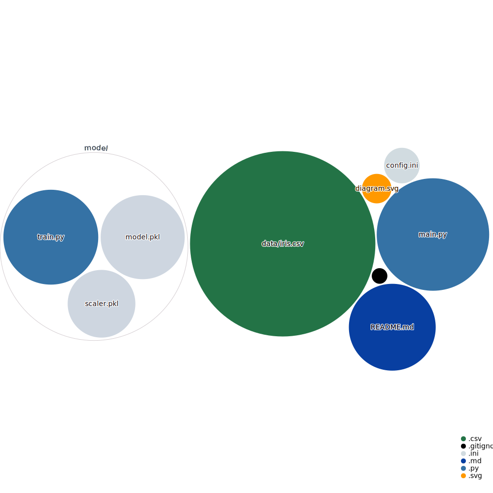

## Intro
A common task as a data scientist is to deploy a model in production. This repo is a boiler plate to deploy a model as a Flask API.

## Data
We use the public Iris dataset.

## Model
The model is a Logistic Regression model.

## Usage
Train your model in train.py  
Deploy it to the API.

## API
Once the API is up and running, you can request your model predictions via:
`http://localhost:5000/model?sepal_length=5.0&sepal_width=2.9&petal_length=1.5&petal_width=0.2`

or from Python:

```python
import requests  

url = "http://localhost:5000/model"  
params = {'sepal_length':'5.0',  
          'sepal_width':'2.9',  
          'petal_length':'1.5',  
          'petal_width':'0.2'}  
r = requests.get(url=url, params=params)  
data = r.json()  ## data = {'prediction': 'Setosa'}
pred = data['prediction']  
```

## Visualization of the codebase

